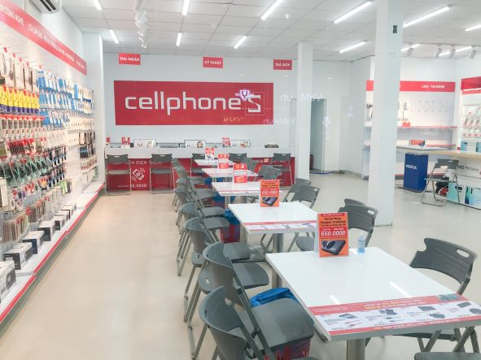

# :iphone: App Bán Điện Thoại Di Động
<h1 align="center">
  
</h1>

## :closed_book: Giới thiệu sản phẩm :green_book:
  - Ngày này công nghệ vô cùng phát triển và càng trởi nên phổ biến trong đời sống hiện nay. Việc mọi người đều sỡ hữu cho mình những chiếc điện thoại thông hay smartphone ngày một nhiều hơn và thông dụng hơn. Những chiếc điện thoại di động giúp mọi người dễ dàng hơn trong việc tra cứu thông tin, dễ dàng giao tiếp và dễ dàng tiếp cận nhau hơn thông qua mạng xã hội. Việc các cửa hàng bán điện thoại cũng trởi nên một nhiều hơn và dễ dàng tiếp cận khách hàng và giúp khách hàng thuận tiện hơn trong việc mua các sản phẩm điện thoại mới nhất thì App CellphoneS ra đời với đầy đủ các chức năng như đặt hàng, xem thông tin chi tiết sản phẩm.

  

### 🎨 Các công cụ hỗ trợ 🔧

  
  
  

#### : Các thành viên có trong team :
 <table>
        <tr>
            <th>Number</th>
            <th>Name</th>
            <th>Account</th>
            <th>Role</th>
        </tr>
        <tr>
            <td>1</td>
            <td>Nguyễn Thanh Bình</td>
            <td>nguyenthanhbinh2610</td>
            <td>Product Owner, Dev</td>
        </tr>
        <tr>
            <td>2</td>
            <td>Lê Nguyễn Gia Bảo</td>
            <td>Zebao1511</td>
            <td>ScrumMaster, Dev</td>
        </tr>
        <tr>
            <td>3</td>
            <td>Nguyễn Minh Khang</td>
            <td>KhangNguyen1302</td>
            <td>TeamLead, Dev</td>
        </tr>
       <tr>
            <td>4</td>
            <td>Ngô Trần Hoàng Phát</td>
            <td>PhatNgo03</td>
            <td>Dev</td>
        </tr>
    </table>
