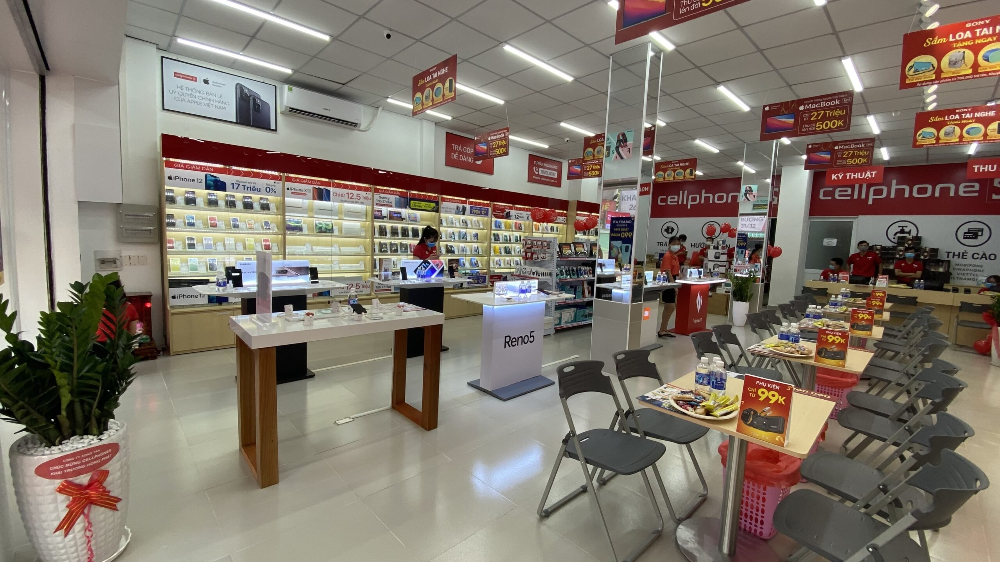

   # :iphone: App Bán Điện Thoại Di Động Nhóm 1 :iphone:
<h1 align="center">
  
</h1>

## :closed_book: Giới thiệu sản phẩm :green_book:
  - Ngày này công nghệ vô cùng phát triển và càng trởi nên phổ biến trong đời sống hiện nay. Việc mọi người đều sỡ hữu cho mình những chiếc điện thoại thông hay smartphone ngày một nhiều hơn và thông dụng hơn. Những chiếc điện thoại di động giúp mọi người dễ dàng hơn trong việc tra cứu thông tin, dễ dàng giao tiếp và dễ dàng tiếp cận nhau hơn thông qua mạng xã hội. Việc các cửa hàng bán điện thoại cũng trởi nên một nhiều hơn và dễ dàng tiếp cận khách hàng và giúp khách hàng thuận tiện hơn trong việc mua các sản phẩm điện thoại mới nhất thì App CellphoneS ra đời với đầy đủ các chức năng như đặt hàng, xem thông tin chi tiết sản phẩm.
  - Để mở rộng hoạt động kinh doanh của mình, công ty muốn xây dựng một ứng dụng thương mại điện tử nhằm thuận tiện cho khách hàng đặt và mua các sản phẩm của công ty ở bất cứ đâu, cung cấp các mặt hàng mới nhất và tốt nhất.
  - Hệ thống mới sẽ đảm bảo cho khách hàng tự do xem các sản phẩm có trong  App, dễ dàng tìm kiếm, lựa chọn các sản phẩm ưa thích, việc mua hàng được thực hiện nhanh chóng, quá trình thanh toán đơn hàng đa dạng đảm bảo và tuân thủ các chính sách của công ty. Bên cạnh đó,chức năng thanh toán sẽ có nhiều sự lựa chọn cho khách hàng như thanh toán trực tiếp khi đặt mua sản phẩm hoặc thanh toán qua các ví điện tử như Momo.Ngoài ra, khách hàng nếu có nhu cầu hủy đơn hàng hoặc hoàn trả đơn hàng thì hệ thống cũng sẵn sàng đáp ứng và thực hiện việc hoàn tiền 100% .Với các chính sách ưu đãi mà chúng tôi đem lại chắc chắn sẽ giúp cho khách hàng cảm thấy hài lòng về sản phẩm của chúng tôi.

 
 
 
### 🎨 Các công cụ hỗ trợ 🔧

  
  
  

 
 
### :construction_worker: Các thành viên có trong team :feelsgood:
 <table>
        <tr>
            <th>Number</th>
            <th>Name</th>
            <th>Account</th>
            <th>Role</th>
        </tr>
        <tr>
            <td>1</td>
            <td>Nguyễn Thanh Bình</td>
            <td>nguyenthanhbinh2610</td>
            <td>Product Owner, Dev</td>
        </tr>
        <tr>
            <td>2</td>
            <td>Lê Nguyễn Gia Bảo</td>
            <td>Zebao1511</td>
            <td>ScrumMaster, Dev</td>
        </tr>
        <tr>
            <td>3</td>
            <td>Nguyễn Minh Khang</td>
            <td>KhangNguyen1302</td>
            <td>TeamLead, Dev</td>
        </tr>
       <tr>
            <td>4</td>
            <td>Ngô Trần Hoàng Phát</td>
            <td>PhatNgo03</td>
            <td>Dev</td>
        </tr>
    </table>

 
 
### :sparkles: Những gì đã làm được :white_check_mark:
Hiện tại đã hoàn thành: 
- Sprint 1 với các chức năng như:
  <ul>
     <li>Xem trang chủ.</li>
     <li>Xem danh sách sản phẩm.</li>
     <li>Đăng ký, Đăng nhập, Đăng xuất.</li>
     <li>Xem chi tiết sản phẩm</li>
     <li>Chỉnh sửa thông tin cá nhân.</li>
  </ul>
   
- Sprint 2: Đã hoàn thành các chức năng như
  <ul>
     <li>Quản lí sản phẩm.</li>
     <li>Quản lí giỏ hàng.</li>
     <li>Mua hàng</li>
     <li>Xem tất cả đơn hàng</li>
     <li>Xem thông tin chi tiết đơn hàng</li>
     <li>Xem phương thức thanh toán</li>
     <li>Quản lí mua hàng</li>
     <li>Xem lịch sử mua hàng</li>
  </ul>
   
- Sprint 3: Đang hoàn thiện:
  <ul>
     <li>Quản lý người dùng</li>
     <li>Quản lý kho</li>
     <li>Xem thông tin vận chuyển</li>
     <li>Hủy đơn hàng</li>
     <li>Phân loại khách hàng</li>
     <li>Tạo khảo sát về ý kiến người dùng</li>
     <li>Đánh giá sản phẩm</li>
  </ul>

 
 
### :dragon_face: Hướng phát triển :trident:
<ul>
   <li>Phát triển thêm chức năng quản lí và áp dụng các mã ưu đãi.</li>
   <li>Cải thiện tốc độ xử lí của ứng dụng.</li>
   <li>Thêm chức năng thông báo cho User mỗi khi có các chương trình giảm giá</li>
   <li>Phát triển tính năng giảm giá các sản phẩm có thời hạn</li>
   <li>Cải thiện thêm giao diện cho App</li>
   <li>Tối ưu ứng dụng</li>
</ul>

 
 

  

 
<h1 align="center"> :heart: Thanks For Watching :heart: </h2>

